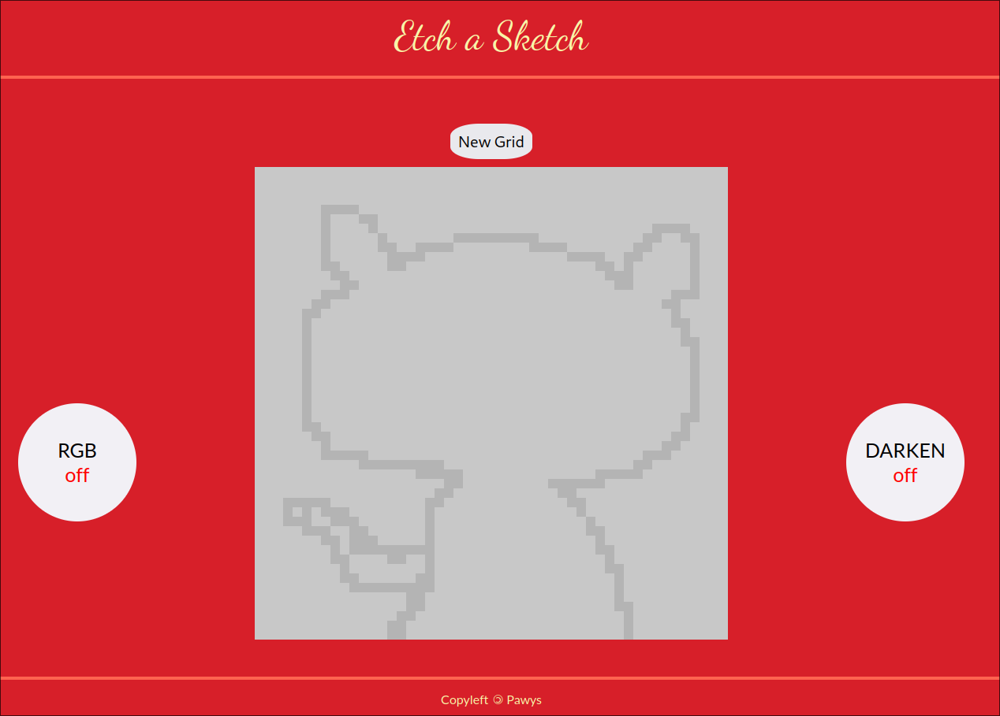

# Etch A Sketch
This is the Etch a sketch project from the (amazing) [The Odin Project curriculum](https://www.theodinproject.com/).

It's an etch a sketch made in JavaScript, featuring an RGB and darken mode. The user can pick how large the grid has to be.

# Skills
### After completing it, I learned:
Making a grid using flexbox.

Getting a random RGB value.

Getting user input using prompts.
# Tech
### This project was made with:
[HTML]

[JS]

[CSS]
# Live Preview
See the page in the [Live Preview](https://pawys.github.io/Etch-a-Sketch./)

